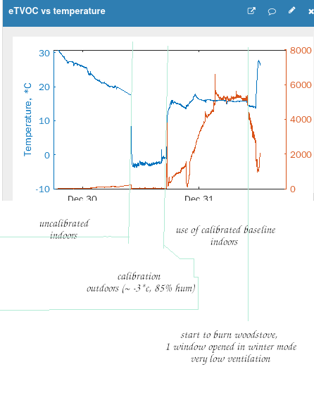

# ESP8266-Weather_station
esp8266, cjmcu8118+hdc1080, bmp180, ccs811, gy30, ssd1306 oled, rotated eeprom, switch interrupt handler, bmp180 custom calibration

 Indoor air quality & weather station with Oled display.
 
 https://thingspeak.com/channels/1579072
 
# Features:
  - status bar - show datetime and outdoor/indoor temperature;
  - indoor details frame: indoor sensors readings;
  - current weather frame: weather icon, weather short description and temperature;
  - weather forecast frame: forecast for 3 days - day, icon and temperature;
  - frame autochange;
  - display sleep timeout;
  - display on/off by button onSingleClick;
  - read sensors every second, upload data to thingspeak once in a minute;
  - store CCS811 baseline into EEPROM (onLongPress) and restore (on boot & onPress);
  - custom calibration for bmp180 temperature sensor to fix factory calibration (or soldering overheating failure) (seek for .ods in project src lib folder)

# todo
  - > restore ccs811 baseline from EEPROM. (by timer - restore after 20 min or check that baseline is steady?)
  - > recalibrate bsp180 pressure sensor based on outdoor temperature or calculate pressure based on factory calibration...
  - lower sensor reading frequency based on inactivity time
  - add forecast day/night temperatures 
  - add more details for current weather data (sun/moon daytime)
  
# remarks
  - tocheck# it seems it's a bad idea to train CCS811 baseline outdoors at low temperature for indoor use.
  - maybe it needs some more time to settle down?
  - how wrong temperature compensation affects baseline training?

  
  
# Custom libraries and changes 
 * PinButtonEventISR
   - static library to use with button interrupts. Handles debounced clicks (single, double, may identify long click too and press*) and hold (short, long) events. 
     (every click and hold starts with press which currently is not identified)
   #211230 v1.1.0
    - fix gap after dbl click delay and before hold delay occurs
  
 * Adafruit_BMP085_Library
   - allow to override factory calibration variables, to fix faulty readings (faulty calibration or overheating failure)
   - at the same time allow to calculate pressure using factory calibration
   - NB temperature compensation works like a charm, however some time needed to be completely sure 
    
 * SparkFun_CCS811_Arduino_Library
   - read firmware, bootloader, application versions ([ported from](https://github.com/maarten-pennings/CCS811))
   
 * esp8266-oled-ssd1306
  #211229
   - added resetState method to reset timers and move to the first frame
   - dont draw abything if display is not awake
  #211225
   - added isAwake display status flag to avoid rendering when display is off
 
 * ClosedCube_HDC1080  
  #211225
   - added begin method that allows to override default resolution parameters

